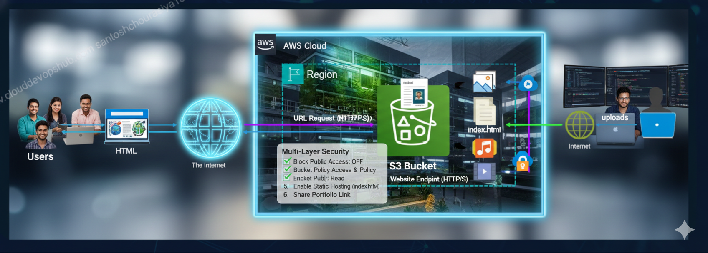
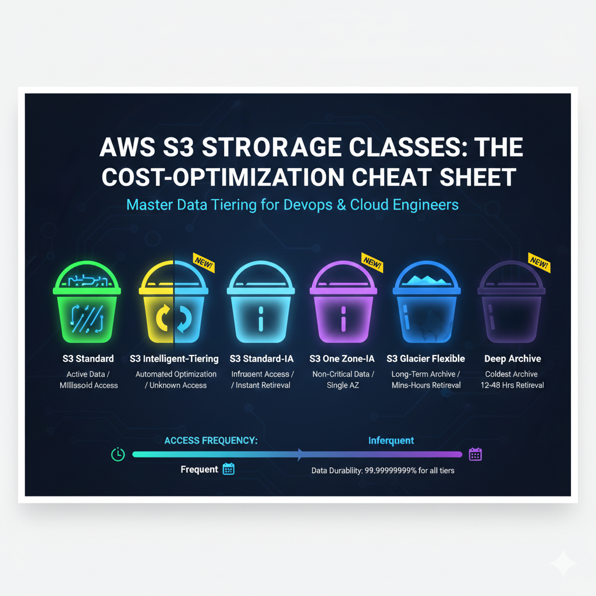

# AWS S3 – Complete Notes
## Core Fundamentals
### Buckets & Objects

**AWS S3 Static Website Hosting Flow**

**S3 Bucket Structure**

- Bucket is a unique container
- Objects store actual data
- Global namespace is required

**S3 is a key-value based object storage service**
 
1. Core Fundamentals (The Basics)
•	Buckets & Objects: Bucket ek unique container hai aur object data file hai.
•	Global Namespace: Bucket ka naam poori duniya mein unique hona chahiye.
•	Key-Value Pair Storage: S3 data ko key (path/name) aur value (file) ke roop mein store karta hai.
•	Metadata: System metadata (file size, date) aur User-defined metadata.
2. Storage Management & Cost Optimization
•	Storage Classes: Standard, Intelligent-Tiering, Standard-IA, One Zone-IA, Glacier (Flexible & Deep Archive).
•	Lifecycle Policies: Transitions (moving classes) aur Expiration (deletion).
•	S3 Storage Class Analysis: Ye batata hai ki kab data ko Glacier mein move karna chahiye.
•	S3 Lens: Pure account ka storage usage aur activity dashboard.
3. Data Security & Access Control (Most Important)
•	Block Public Access (BPA): Account aur bucket level par public access block karna.
•	Bucket Policies: JSON-based resource policies.
•	IAM Policies: User-based permissions.
•	Access Control Lists (ACLs): Individual objects ke liye purana permission method.
•	Encryption (At Rest): SSE-S3, SSE-KMS, SSE-C.
•	Encryption (In Transit): HTTPS/SSL/TLS.
•	S3 Object Lock: WORM (Write Once Read Many) policy for compliance.
4. Advanced Features & Performance
•	Versioning: Har file ke multiple versions rakhna accidental deletion se bachne ke liye.
•	MFA Delete: Bina OTP ke bucket delete na ho sake.
•	Multi-part Upload: Badi files ko chunks mein upload karna (5GB+ files ke liye mandatory).
•	S3 Transfer Acceleration: Upload speed badhane ke liye Edge Locations ka use.
•	S3 Select: Puri file download kiye bina SQL query se specific data nikalna.
•	Presigned URLs: Temporary access provide karna.
5. Data Replication & Disaster Recovery
•	CRR (Cross-Region Replication): Data ko dusre region mein copy karna DR (Disaster Recovery) ke liye.
•	SRR (Same-Region Replication): Ek hi region ke buckets mein sync rakhna.
•	S3 Batch Operations: Lakho-karodo objects par ek saath kaam karna (jaise copy ya tagging).
6. Monitoring & Logging
•	Server Access Logging: Har request ka record rakhna (kisne, kab access kiya).
•	CloudTrail Integration: API calls ka audit rakhna.
•	CloudWatch Metrics: Storage size aur request rates monitor karna.
•	S3 Event Notifications: File upload par Lambda, SQS ya SNS trigger karna.
7. Practical Scenarios (Interview Focus)
•	Static Website Hosting: S3 ko website banane ke liye use karna.
•	CORS (Cross-Origin Resource Sharing): Do alag domains ke beech data share karna.
•	Consistency Model: S3 ab "Strong Read-after-Write Consistency" deta hai (pehle eventual tha)

1. Buckets & Objects: The Logical Container
S3 ek Object Storage service hai, jo normal file system (jaise aapka C: Drive ya Pendrive) se bilkul alag hoti hai.
•	Bucket (Container): Bucket ko aap ek "Super Folder" ki tarah samjhein. S3 mein koi bhi data rakhne ke liye aapko sabse pehle ek bucket banana padta hai.
•	Object (The Data): Jo bhi file (photo, video, document) aap upload karte hain, use "Object" kaha jata hai. Ek object ki size 0 bytes se lekar 5 TB tak ho sakti hai.
•	Limit: Ek AWS account mein default limit 100 buckets ki hoti hai, jise aap request karke badha sakte hain.
________________________________________
2. Global Namespace: Unique Identity
Ye S3 ka sabse interesting aur thoda challenging part hai.
•	Global Uniqueness: Jab aap bucket ka naam rakhte hain, toh wo sirf aapke account mein hi nahi, balki poori duniya (Global) mein unique hona chahiye.
•	Kyu? Kyunki har bucket ka ek unique URL banta hai. Agar do log ek hi naam ka bucket banayenge, toh DNS (Domain Name System) confuse ho jayega.
•	Example: Agar maine santosh-resume naam ka bucket bana liya, toh ab duniya mein koi aur is naam ka bucket nahi bana sakta jab tak main use delete na kar doon.
________________________________________
3. Key-Value Pair Storage: How data is indexed
S3 mein files "Folders" mein nahi, balki Key-Value pairs mein store hoti hain. Halanki hume console mein folders dikhte hain, lekin background mein wo sirf ek lambi "Key" hoti hai.
•	Key (The Name): Ye object ka poora path ya naam hota hai.
o	Example: uploads/2024/resume.pdf. Yahan ye poori string ek "Key" hai.
•	Value (The Content): Ye wo actual data (bits and bytes) hai jo file ke andar hai.
•	Flat Structure: S3 ka structure "flat" hota hai. Jo folders hume dikhte hain (/), wo sirf virtual delimiters hain taaki humans ko samajhne mein aasani ho.
________________________________________
4. Metadata: Information about the Data
Metadata ka matlab hai "Data about data". Jab aap koi object S3 mein save karte hain, toh uske saath kuch extra information bhi store hoti hai.
•	System Metadata: Ye AWS khud manage karta hai. Isme file ki size, upload date, Last Modified time, aur ETag (file ka MD5 hash) hota hai.
•	User-defined Metadata: Aap khud bhi apni extra information add kar sakte hain upload ke waqt.
o	Example: Aapne ek photo upload ki aur metadata set kiya department: HR. Isse baad mein files ko filter karne ya automate karne mein bahut madad milti hai.
________________________________________
Interview Tip for Core Fundamentals:
Interviewer puch sakta hai: "S3 mein 'Folder' jaisa kuch hota hai kya?" Aapka Answer: "Sir, physically S3 ek flat storage hai. Folders sirf logical separation ke liye 'Key' ka hissa hote hain (Prefixes kehte hain inhe). Background mein ye sab Key-Value pairs hi hain."

 

1. Storage Classes (Paisa Bachane ka Engine)
S3 mein data ko uske use-case ke hisab se alag-alag classes mein rakha jata hai. Har class ki price aur access speed alag hoti hai:
•	S3 Standard: Ye default class hai. Iska use frequent access wale data ke liye hota hai (jaise website ki images). Iski durability 11-nines hoti hai.
•	S3 Intelligent-Tiering: Sabse smart option! Ye machine learning use karke data ko apne aap 'Frequent' aur 'Infrequent' tiers ke beech move karta hai jab access pattern unknown ho. Isme koi retrieval fee nahi lagti.
•	S3 Standard-IA (Infrequent Access): Un files ke liye jo kabhi-kabhi chahiye (e.g., purane backups). Storage sasta hai par data nikalne (retrieval) ke paise lagte hain.
•	S3 One Zone-IA: Ye Standard-IA jaisa hai par data sirf ek hi Availability Zone (AZ) mein rehta hai. Agar wo AZ down hua toh data milna mushkil hai. Ye non-critical data ke liye sasta option hai.
•	S3 Glacier Flexible Retrieval: Archive data ke liye (retrieval time minutes se hours).
•	S3 Glacier Deep Archive: Sabse sasta storage! Compliance data ke liye best hai jo saalo tak store karna ho (retrieval time 12-48 hours).
________________________________________
2. Lifecycle Policies (Set it and Forget it)
Lifecycle rules automation ke liye hote hain taaki aapko har file manually delete ya move na karni pade:
•	Transitions (Moving Classes): Aap rule bana sakte hain ki "30 din baad meri file Standard se Glacier mein chali jaye".
•	Expiration (Deletion): Aap rule bana sakte hain ki "Logs 90 din baad apne aap delete ho jayein".
•	DevOps Fact: Lifecycle rules se hum Incomplete Multipart Uploads ko bhi auto-delete karte hain taaki faltu storage ka bill na aaye.
________________________________________
3. S3 Storage Class Analysis
Ye tool aapko "Data Analytics" provide karta hai.
•	Function: Ye aapke bucket ke access patterns ko monitor karta hai aur ek report deta hai.
•	Benefit: Ye aapko batata hai ki aapka kaun sa data purana ho gaya hai aur use kab Standard-IA ya Glacier mein move karna chahiye taaki bill kam ho sake.
________________________________________
4. S3 Lens (The Dashboard)
Agar aapke account mein 50 buckets hain, toh har ek ko check karna mushkil hai. S3 Lens wahan kaam aata hai.
•	Visibility: Ye pure AWS account ke S3 usage ka ek single dashboard view deta hai.
•	Insights: Isme 28+ metrics hote hain jo dikhate hain ki storage kahan badh raha hai, data secure hai ya nahi (BPA status), aur kahan paisa bachaya ja sakta hai.
•	DevOps Tool: L2/L3 support mein ye daily monitoring ke liye best tool hai.
________________________________________
Interview Question Scenario:
Interviewer: "Hamare paas 100TB data hai jo 6 mahine baad delete karna hai par pehle 1 mahine frequent chahiye. Kaun si strategy best hai?" Aapka Answer: "Sir, main ek Lifecycle Policy banaunga. Pehle 30 din data S3 Standard mein rahega. 31st day par use S3 Standard-IA ya Glacier mein move (Transition) karunga. Aur 180th day par Expiration rule se use delete kar dunga. Isse storage cost 60-70% tak kam ho jayegi."
1. Block Public Access (BPA)
Ye AWS ka "Master Safety Switch" hai.
•	Purpose: Iska kaam hai galti se bhi kisi bucket ya object ko internet par public hone se rokna.
•	Levels: Ye account level (pure account ke liye) aur bucket level (sirf us bucket ke liye) dono par lagaya ja sakta hai.
•	 bDevOps Rule: Jab tak aapko static website host na karni ho, BPA hamesha ON rehna chahiye.
________________________________________
2. Bucket Policies vs. IAM Policies
Dono hi permissions ke liye hain, par inka "Focus" alag hota hai:
•	Bucket Policies (Resource-based): Ye JSON format mein hoti hain aur directly bucket par attach ki jati hain. Ye batati hain ki "is bucket ke andar kaun aa sakta hai". Humne aapke portfolio ke liye yahi use kiya tha.
•	IAM Policies (User-based): Ye specific user ya role par lagti hain. Ye batati hain ki "ye banda AWS mein kya-kya kar sakta hai".
•	Conflict: Agar IAM allow kare par Bucket Policy deny, toh result hamesha Deny hoga. Deny hamesha win karta hai.
________________________________________
3. Access Control Lists (ACLs)
Ye permissions ka sabse purana tarika hai.
•	Granular Control: Isse aap individual files (objects) par permission set kar sakte hain.
•	Modern Approach: AWS ab ACLs ko disable karne ki advice deta hai aur Bucket Policies use karne ko kehta hai kyunki wo zyada secure aur manage karne mein aasaan hain.
________________________________________
4. Encryption: Data ki Suraksha
Data ko "Read" karne layak na chhodna agar wo chori ho jaye.
•	At Rest (Server Side Encryption - SSE): Jab data disk par rakha ho.
o	SSE-S3: Sabse aasaan. AWS khud keys manage aur rotate karta hai.
o	SSE-KMS: DevOps engineers ka favorite. Isme aapko audit logs milte hain (kisne kab key use ki) aur aap keys khud manage kar sakte hain.
o	SSE-C: Client-provided keys. Aap apni key AWS ko dete ho, AWS use save nahi karta, sirf encrypt karke bhool jata hai.
•	In Transit: Jab data internet par travel kar raha ho. Iske liye hum HTTPS (SSL/TLS) use karte hain taaki raste mein koi data "sniff" na kar sake.
________________________________________
5. S3 Object Lock (WORM)
Ye compliance aur legal requirements ke liye hota hai.
•	WORM: Write Once, Read Many.
•	Function: Ek baar file upload ho gayi aur lock lag gaya, toh use koi bhi delete ya overwrite nahi kar sakta—yahan tak ki Root user bhi nahi (agar Compliance mode mein hai).
•	Use Case: Banking transactions ya legal documents jinhe 7-10 saal tak delete karna mana hota hai.
________________________________________
Interview Question Scenario:
Interviewer: "Maine Bucket Policy mein 'Allow' de diya hai, lekin phir bhi access nahi mil raha. Kya wajah ho sakti hai?" Aapka Answer: "Sir, teen reasons ho sakte hain:
1.	BPA: Account level par 'Block Public Access' ON ho sakta hai jo policy ko override kar raha hai.
2.	IAM Deny: User ki IAM policy mein explicit 'Deny' laga ho sakta hai.
3.	Encryption: Agar file KMS se encrypted hai aur user ke paas KMS key ki permission nahi hai, toh wo file download nahi kar payega."
1. Versioning: Accidental Deletion ka ilaj
•	Concept: Jab aap Versioning enable karte hain, toh S3 har object ki history maintain karta hai. Agar aapne resume.pdf ko edit karke firse upload kiya, toh purana resume delete nahi hota balki ek "Version ID" ke saath piche save ho jata hai.
•	Benefit: Agar galti se koi file delete ho jaye, toh aap uska "Delete Marker" hata kar use restore kar sakte ho.
•	Cost Tip: Yaad rakhna, har version ke storage ke paise lagte hain. Isliye purane versions ko delete karne ke liye Lifecycle Policy zaroor lagayein.
2. MFA Delete: Extra Security Layer
•	Concept: Sirf password kafi nahi hai. Agar Versioning ON hai, toh aap MFA (Multi-Factor Authentication) Delete enable kar sakte hain.
•	Function: Iske baad, agar koi banda kisi file ka version delete karna chahe ya bucket ki versioning state badalna chahe, toh use OTP (MFA Token) dalna padega.
•	Interview Point: Ye "Insider Threats" (agar koi gusse mein employee data delete karna chahe) se bachne ka sabse best tarika hai.
3. Multi-part Upload: Big Data Strategy
•	Constraint: S3 mein ek single PUT operation se aap maximum 5 GB ki file upload kar sakte hain. Lekin agar file 100 GB ki hai toh?
•	Solution: Multi-part Upload badi file ko chhote-chhote parts (chunks) mein tod deta hai aur unhe parallel mein upload karta hai.
•	Advantage:
1.	Fault Tolerance: Agar 10th part fail hua, toh sirf wahi part dubara upload karna padega, puri 100GB file nahi.
2.	Speed: Parts parallel mein upload hote hain, isliye speed badh jati hai.
•	Pro Tip: 100 MB se badi files ke liye hamesha Multi-part upload use karne ki advice di jati hai.
4. S3 Transfer Acceleration
•	Problem: Agar aapka bucket Mumbai mein hai aur aapka client New York se 10 GB ka data upload kar raha hai, toh internet latency (deri) ki wajah se ye bahut slow hoga.
•	Solution: S3 Transfer Acceleration AWS ke Edge Locations (CloudFront network) ka use karta hai.
•	Flow: Data pehle client ke paas wale Edge Location par jata hai, aur wahan se AWS ke private fast network (Backbone) ke zariye bucket tak pahunchta hai. Ye normal internet se 50-500% fast ho sakta hai.
5. S3 Select: Querying inside S3
•	Problem: Aapke paas 1 GB ki CSV ya JSON file hai, aur aapko sirf 2 lines ka data chahiye. Normal tarike mein aap poori 1 GB file download karoge fir search karoge.
•	Solution: S3 Select aapko S3 ke andar hi SQL queries (SELECT * FROM s3object WHERE...) chalane ki permission deta hai.
•	Benefit: Isse data transfer cost kam hoti hai aur application ki performance 400% tak badh sakti hai kyunki S3 sirf wahi 2 lines bhejta hai jo aapne mangi hain.
6. Presigned URLs: Temporary VIP Pass
•	Concept: Maan lo aapka bucket Private hai. Ab aapko kisi user ko ek file dikhani hai, par aap use public nahi karna chahte aur na hi user ko IAM account dena chahte ho.
•	Solution: Aap ek Presigned URL generate karte ho. Isme ek expiry time hota hai (jaise 5 minute).
•	Flow: User us link par click karega, file download karega, aur 5 minute baad wo link expire ho jayega.
•	Use Case: Netflix ya Amazon Drive jahan har user ka data private hota hai par unhe download ka temporary link milta hai.
________________________________________
Interview Question Scenario:
Interviewer: "Hamari application bahut badi files upload karti hai aur kabhi-kabhi network fail hone par pura upload fail ho jata hai. Aap ise kaise fix karenge?" Aapka Answer: "Sir, main Multipart Upload implement karunga. Isse file parts mein upload hogi aur agar network fail hota hai, toh hum 'Resume' kar sakenge sirf fail hue part se. Saath hi, agar upload international hai, toh main Transfer Acceleration enable karunga speed badhane ke liye."

1. CRR (Cross-Region Replication)
•	Concept: Isme aapka data ek region (Source) se dusre region (Destination) mein automatically copy hota hai.
o	Example: Aapka primary bucket Mumbai (ap-south-1) mein hai aur aapne CRR setup kiya hai Singapore (ap-southeast-1) ke liye.
•	Kyu use karein?
1.	Disaster Recovery: Agar Mumbai region mein koi badi technical kharabi aa jaye, toh aapka data Singapore mein safe rahega.
2.	Compliance: Kuch companies ke liye rules hote hain ki data ko kam se kam 500 miles door backup rakhna hai.
3.	Latency: Agar aapke users Singapore mein hain, toh wo wahan ke local bucket se data jaldi access kar payenge.
________________________________________
2. SRR (Same-Region Replication)
•	Concept: Isme data ek hi region ke do alag-alag buckets mein copy hota hai.
•	Kyu use karein?
1.	Log Aggregation: Aapke paas 10 alag-alag buckets hain jo logs generate kar rahe hain, aap SRR se unhe ek hi central bucket mein jama kar sakte ho.
2.	Environment Sync: Production bucket se data Developer bucket mein sync rakhna taaki testing ho sake, lekin dono ek hi region mein rahein taaki "Data Transfer Cost" kam lage.
3.	Ownership Change: Ek bucket se dusre bucket mein data bhejte waqt aap object ka owner badal sakte ho (Security ke liye).
________________________________________
3. S3 Batch Operations
•	Problem: Maan lijiye aapke bucket mein 10 Crore (100 Million) photos hain. Ab aapko un sab par ek "Confidential" ka tag lagana hai ya un sabko dusre bucket mein copy karna hai. Agar aap manual ya script se karoge toh mahino lag jayenge.
•	Solution: S3 Batch Operations ek managed service hai jo itne bade scale par kaam karti hai.
•	Kaise kaam karta hai?
1.	Aap ek Inventory Report (files ki list) dete ho.
2.	Aap batate ho kya kaam karna hai (Copy, Tag, Restore from Glacier, etc.).
3.	AWS background mein apne aap hazaro workers laga kar ye kaam kuch ghanto mein khatam kar deta hai.
•	Interview Point: "Sir, jab hume bulk mein objects ki storage class badalni ho ya tagging karni ho, toh hum Batch Operations use karte hain kyunki ye highly scalable aur easy to track hai."
________________________________________
Interview Question Scenario:
Interviewer: "Kya Replication enable karne se purana data apne aap copy ho jata hai?" Aapka Answer: "Nahi Sir. Replication enable karne ke baad jo naye objects upload honge, sirf wahi copy honge. Purane data (Existing objects) ko copy karne ke liye hume S3 Batch Operations ka use karna padega."
________________________________________
Important Note (Replication):
•	Replication Asynchronous hota hai (Matlab: upload ke turant baad copy hone mein thoda time lag sakta hai).
•	Agar aapne Source bucket se file Delete ki, toh by default wo Destination bucket se delete nahi hoti (ye security feature hai taaki accidental delete se bacha ja sake).
DevOps mein "Observability" sabse badi cheez hai. Agar aapko ye nahi pata ki aapke infrastructure mein kya ho raha hai, toh aap use manage nahi kar sakte. S3 Monitoring aur Logging aapko ye batate hain ki aapke data ke saath kaun, kab, aur kya kar raha hai.
________________________________________
1. Server Access Logging (Detailed Request Logs)
•	Concept: Ye bucket level par enable hota hai. Iska kaam hai har us request ka record rakhna jo aapke bucket par aati hai.
•	Kya Record karta hai? * Request karne wale ki IP address.
o	Kisne request ki (User).
o	Kaunsi file access karne ki koshish ki.
o	Request successful thi ya fail (HTTP Status codes jaise 200, 404, 403).
•	Use Case: Agar aapka bill achanak badh jaye, toh aap in logs ko check karke pata laga sakte ho ki kahin koi "Bot" toh aapka data baar-baar download nahi kar raha.
________________________________________
2. CloudTrail Integration (Management Audit)
•	Concept: CloudTrail ka kaam hai API Calls ko track karna.
•	Server Access Logs vs CloudTrail:
o	Access Logs: Ye batate hain ki file kisne Read/Write ki (Data plane).
o	CloudTrail: Ye batata hai ki bucket ki Settings kisne badli (Management plane). Jaise- Bucket kisne delete kiya? Ya Bucket Policy kisne change ki?
•	DevOps Benefit: Security audit ke waqt ye "Source of Truth" hota hai. Aap filter kar sakte ho: "Last 24 hours mein kisne 'DeleteBucket' command chalayi?"
________________________________________
3. CloudWatch Metrics (Performance Tracking)
•	Concept: S3 apne metrics CloudWatch ko bhejta hai. Inhe hum do parts mein dekhte hain:
1.	Storage Metrics: Din mein ek baar update hote hain (Total bucket size, number of objects).
2.	Request Metrics: Ye real-time hote hain (sirf tab jab aap enable karein). Isme aapko "Latency" aur "Error Rates" dikhte hain.
•	Alarms: Aap alarm set kar sakte ho: "Agar bucket ka size 1TB se upar jaye, toh mujhe email aa jaye." ya "Agar 403 (Access Denied) errors 5% se zyada hon, toh alert bhej do."
________________________________________
4. S3 Event Notifications (Automation Trigger)
•	Concept: Ye S3 ki sabse powerfull automation feature hai. Jab bhi bucket mein kuch hota hai (ObjectCreated, ObjectRemoved), S3 ek message bhejta hai.
•	Destinations: Ye message teen jagah ja sakta hai:
1.	Lambda Function: File upload hui -> Lambda trigger hua -> Photo ka thumbnail ban gaya.
2.	SQS (Simple Queue Service): Message queue mein chala gaya taaki koi aur worker use process kare.
3.	SNS (Simple Notification Service): Aapko turant Email ya SMS mil jaye ki "Important file delete ho gayi hai".
•	Example: Jaise hi aapne resume upload kiya, ek Lambda trigger ho jo uska text extract karke database mein save kar de.
________________________________________
Interview Question Scenario:
Interviewer: "Hume kaise pata chalega ki hamari S3 bucket security wise compromised hai?"
Aapka Answer: "Sir, iske liye main teen layers check karunga:
1.	CloudTrail: Ye dekhne ke liye ki kisi ne Bucket Policy ya IAM roles ke saath chhed-chhad toh nahi ki.
2.	Server Access Logs: Ye check karne ke liye ki koi unknown IP address hamara data bulk mein download toh nahi kar raha.
3.	CloudWatch Alarms: Agar '403 Unauthorized' requests achanak badh gayi hain, toh iska matlab hai koi bucket mein ghusne ki koshish kar raha hai."
________________________________________
Quick Table for Revision:
Tool	Focus	Main Question
Server Access Logs	Data Access	Kisne file download ki?
CloudTrail	Management	Bucket ki settings kisne badli?
CloudWatch	Performance	Bucket ka size aur speed kya hai?
S3 Events	Action/Automation	File aate hi kya kaam karna hai?
1. Static Website Hosting: S3 as a Web Server
•	Concept: S3 sirf files store nahi karta, wo unhe ek website ki tarah "Serve" bhi kar sakta hai. Isme aap HTML, CSS, aur JavaScript files host karte ho.
•	Requirements:
1.	Index Document: Ek index.html file honi chahiye.
2.	Public Access: BPA (Block Public Access) ko OFF karna padta hai.
3.	Bucket Policy: Ek JSON policy lagani padti hai jo s3:GetObject permission sabko (*) de.
•	Limitation: S3 sirf Static sites host karta hai. Aap isme PHP, Python, ya Node.js jaisa server-side code nahi chala sakte. Iske liye aapko EC2 ya Lambda chahiye.
________________________________________
2. CORS (Cross-Origin Resource Sharing)
•	Problem: Security ki wajah se, browsers ek domain (e.g., www.google.com) ko dusre domain (e.g., my-s3-bucket.s3.amazon.com) se resources load karne se rokte hain.
•	Concept: Agar aapki website S3 bucket se images ya fonts load kar rahi hai jo kisi aur domain par hai, toh aapko S3 mein CORS configuration (JSON ya XML mein) likhni padti hai.
•	Simple Words: Ye ek tarah ka "NOC" (No Objection Certificate) hai jo S3 deta hai ki "Haan, main is specific domain ko apna data dene ke liye taiyar hoon."
________________________________________
3. Consistency Model: Strong vs Eventual
Ye ek bahut hi high-level interview question hai.
•	Puraani Kahani (Eventual Consistency): Pehle S3 mein agar aap koi purani file "Update" ya "Delete" karte the, toh turant read karne par kabhi-kabhi purana data hi dikhta tha. Isme kuch milliseconds ka delay hota tha.
•	Nayi Kahani (Strong Read-after-Write): Ab AWS ne ise update kar diya hai.
o	Jaise hi aapne naya object Write (PUT) kiya ya purana Update kiya, uske turant baad (ms mein) agar koi use read karega, toh use hamesha latest version hi milega.
•	Interview Answer: "Sir, S3 ab Strong Read-after-Write consistency provide karta hai sabhi PUT aur DELETE operations ke liye. Iska matlab hai ki data write hote hi globally consistent ho jata hai."
________________________________________
Bonus: S3 Interview "Troubleshooting" Scenarios
Q1: Aapne file upload ki, bucket public hai, par URL kholne par '403 Forbidden' aa raha hai. Kyu?
•	Answer: Do wajah ho sakti hain: 1. Index document ka naam sahi nahi hai settings mein. 2. Bucket Policy mein s3:GetObject permission miss hai.
Q2: S3 bucket full ho sakta hai kya?
•	Answer: Technically, S3 ki storage unlimited hai. Aap jitna chaho data daal sakte ho, bas ek single object 5TB se bada nahi hona chahiye.
Q3: Kya hum S3 par database install kar sakte hain?
•	Answer: Nahi. S3 Object Storage hai, Block Storage (EBS) nahi. Database ko OS level ka access chahiye hota hai jo S3 nahi deta.

